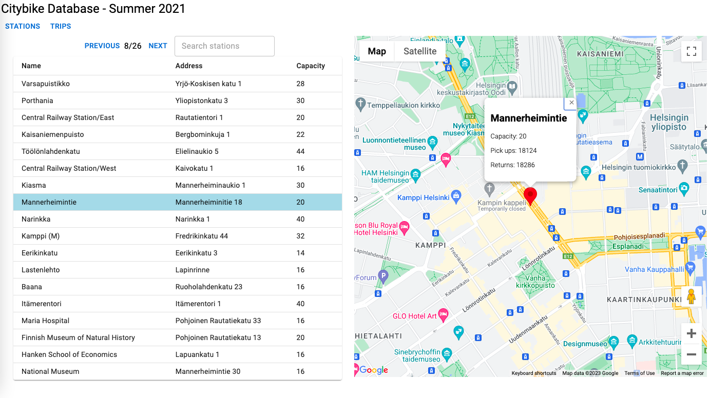
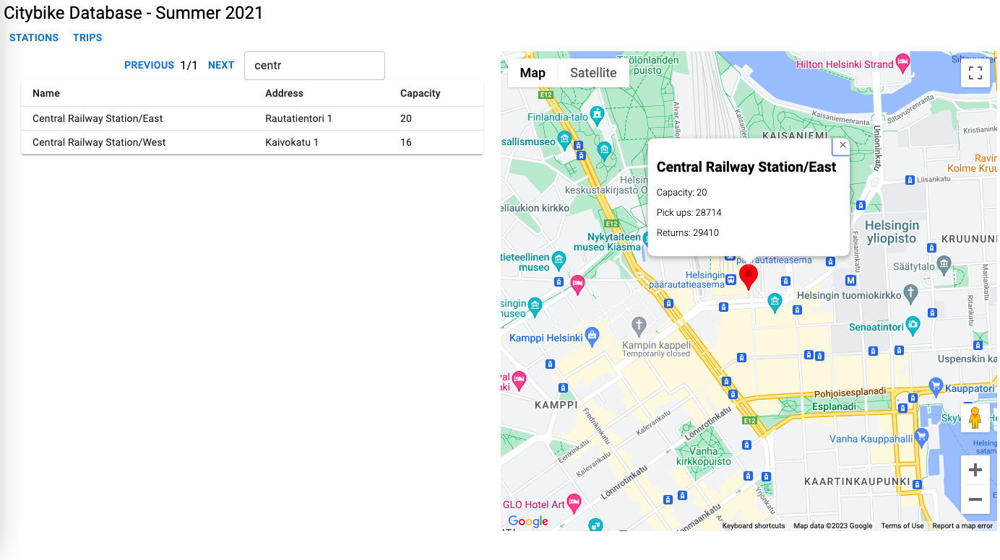
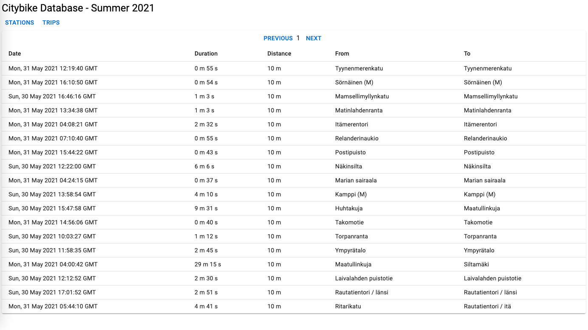
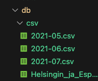

# Helsinki city bike app (Dev Academy pre-assignment)

Repository for Solita Dev Academy pre-assignment. The task was to create a UI and a backend service for displaying data from journeys made with city bikes in the Helsinki Capital area. The dataset contains 3M+ journeys made in summer 2021.

## Implemented Features

- Separate views for exploring journeys and stations
- Pagination
- Searching stations
- Station locations on a map
- Station specific pick up and return count
- Sorting journeys by clicking column names

## Key Technologies

- Node.js & Express
- React
- Material UI
- MongoDB
- Docker

## TODO

- Tests
- Filter journeys
- Create intresting data insights
- Optimize API performance when exploring journeys for better user experience - One thing that comes to mind is prefetching pages
- Automatically download csv files when setting up database

## Screenshots

#### Station view



#### Search



#### Journey view, sorted by distance



## Installation

1.  Clone repository

    ```sh
    git clone https://github.com/klehik/citybikeapp.git
    ```

2.  Download 4 citybike data files

    - [2021-05.csv](https://dev.hsl.fi/citybikes/od-trips-2021/2021-05.csv)
    - [2021-06.csv](https://dev.hsl.fi/citybikes/od-trips-2021/2021-06.csv)
    - [2021-07.csv](https://dev.hsl.fi/citybikes/od-trips-2021/2021-07.csv)
    - [stations.csv](https://opendata.arcgis.com/datasets/726277c507ef4914b0aec3cbcfcbfafc_0.csv)

3.  Move the files into citybikeapp/backend/db/csv. Do not modify the filenames

    

4.  Set up and run backend using the options below

5.  Set up and run frontend with instructions below

### Backend option 1: Run backend in Docker container (recommended)

1. Install [Docker](https://docs.docker.com/get-docker/)
2. Build container
   ```sh
   cd backend
   docker-compose build
   ```
3. Run container. The citybike data files are imported to the database on the first run. It may take a while
   ```sh
   docker-compose up
   ```

### Backend option 2: Run backend without docker

1. Install [Node.js](https://nodejs.org/en/download)

2. Install [MongoDB](https://www.prisma.io/dataguide/mongodb/setting-up-a-local-mongodb-database)

3. Create .env file into citybikeapp/backend/ with MongoDB connection string
   ```js
   MONGO_URI = 'e.g. mongodb://127.0.0.1:27017/citybikeapp'
   ```
4. Install dependencies
   ```sh
   cd backend
   npm install
   ```
5. Run backend. The citybike data files are imported to the database on the first run. It may take a while
   ```sh
   npm start
   ```

### Frontend

1. Install [Node.js](https://nodejs.org/en/download) if not already installed

2. Install dependencies

   ```sh
   cd frontend
   npm install
   ```

3. Get a [Google Maps API key](https://developers.google.com/maps/documentation/javascript/get-api-key) and create .env file into citybikeapp/frontend. App should work without the key but the map is displayed in development mode.
   ```js
   REACT_APP_MAPS_API_KEY = ''
   ```
4. Run and go to http://localhost:3000
   ```sh
   npm start
   ```
